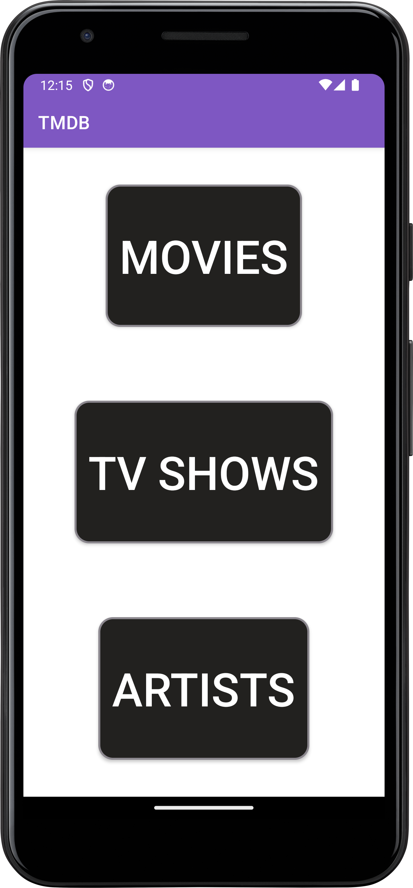
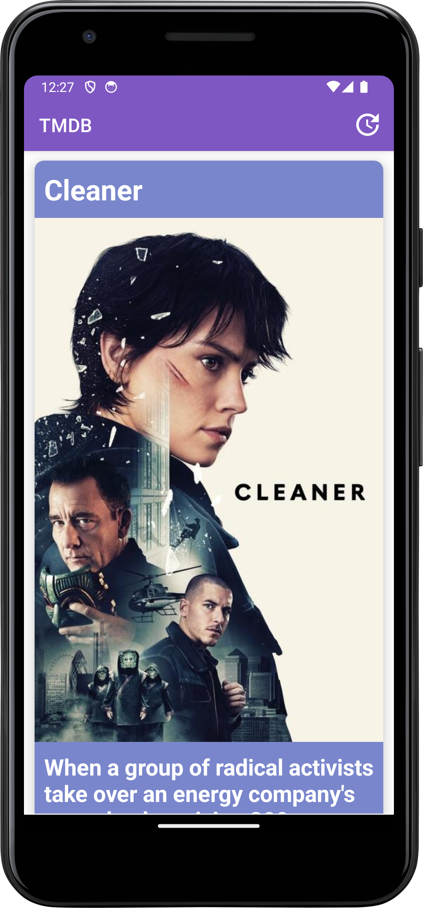
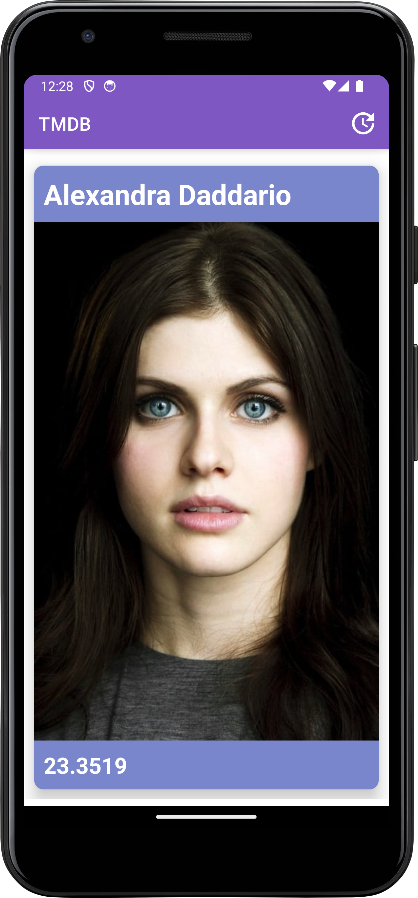
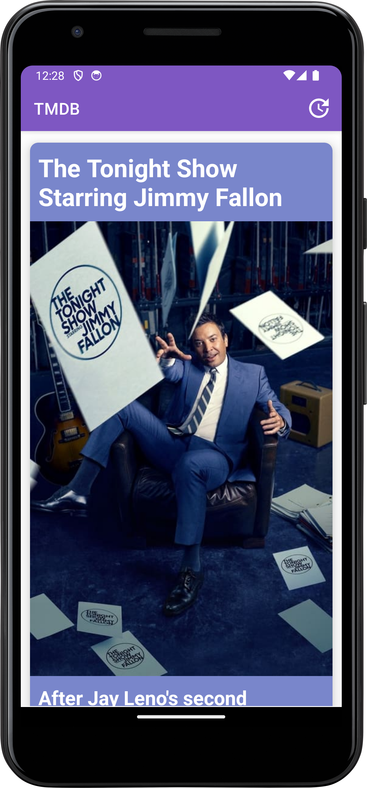

## Overview

The TMDB App is a demo Android application designed to fetch and display popular movies and related details from [The Movie Database (TMDB) API](https://www.themoviedb.org/).  
It implements the **MVVM architectural pattern** using modern Android Jetpack components:
- **Data Binding** and **View Binding** for efficient and safe UI binding.
- **ViewModel** and **LiveData** for lifecycle-aware UI data handling.
- **Room** for local caching.
- **Retrofit** with **Coroutines** to perform asynchronous network calls.
- **Dagger** for dependency injection.

  The project demonstrates clean code practices, separation of concerns, and scalable codebase structure—all while delivering a pleasant and responsive user experience.
  ## Tech Stack

- **Language:** Kotlin
- **Architecture:** MVVM
- **UI Components:** Data Binding, View Binding, Material Design
- **Networking:** Retrofit, Coroutines
- **Local Storage:** Room
- **Dependency Injection:** Dagger
- **Reactive:** LiveData, ViewModel

  ## Screenshots

Here are some screenshots of the app in action:

  
  
  
    

